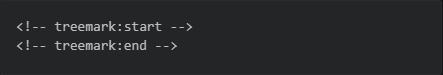
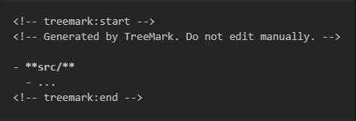

# TreeMark

> Generate and synchronize Markdown-friendly directory trees.

TreeMark is a small, cross-platform Node.js CLI for turning a real directory
structure into deterministic Markdown or ASCII output.

It can:

- print a directory tree to stdout;
- write a complete generated structure file with `--output`;
- update one TreeMark-owned region inside an existing Markdown document with
  `--update`;
- verify generated content without writing anything with `--check`;
- generate Markdown links relative to the receiving document;
- apply repeatable ignore patterns and maximum-depth limits.

TreeMark is designed for documentation workflows, project structure maps, and
CI checks where generated directory trees should stay predictable and easy to
review.

## Requirements

- Node.js 22 or newer.
- npm.

## Installation

```bash
npm install --global treemark
```

Then run:

```bash
treemark --help
```

## Quick start

Print the current directory as Markdown:

```bash
treemark .
```

Scan another directory:

```bash
treemark ./docs
```

Generate ASCII instead:

```bash
treemark ./docs --format ascii
```

## Output formats

### Markdown

Markdown is the default format:

```bash
treemark ./docs
```

Example:

```md
- **guides/**
  - [install.md](guides/install.md)
  - [usage.md](guides/usage.md)
- [overview.md](overview.md)
```

Use `--no-links` when you want plain file labels instead of Markdown links:

```bash
treemark ./docs --no-links
```

### ASCII

```bash
treemark ./docs --format ascii
```

Example:

```text
guides/
├── install.md
└── usage.md
overview.md
```

## Write a generated file

Use `--output` to write a complete generated file:

```bash
treemark ./docs --output docs-map.md
```

If `--output` is provided without a filename, TreeMark writes:

```text
structure-map.md
```

Example:

```bash
treemark ./docs --output
```

When an output target is inside the scanned root, TreeMark automatically
excludes that target from the generated structure so the file does not list
itself.

TreeMark does not create missing parent directories for output targets.

## Synchronize part of an existing Markdown file

TreeMark can own one marked region inside an existing Markdown document while
preserving everything outside that region.

Add exactly one marker pair:



> For copyable marker syntax, search this README for `treemark:start` or `treemark:end`, then use the live marker pair in the Project structure section.

Then run:

```bash
treemark . --update README.md
```

TreeMark replaces everything between the markers and inserts its generated
ownership notice:



The marker rules are intentionally strict:

- exactly one start marker and one end marker must exist;
- the start marker must come before the end marker;
- each marker must be the only non-whitespace content on its line;
- everything inside the markers is TreeMark-owned and may be replaced;
- everything outside the markers is preserved.

For ASCII synchronization:

```bash
treemark . --update README.md --format ascii
```

TreeMark places the ASCII tree inside a fenced `text` block.

### Safe update workflow

Treat the marked region as generated content.

A good workflow is:

1. Run `--update`.
2. Review the changed file or Git diff.
3. Commit the result only after verifying the generated change.

TreeMark performs updates by building the complete replacement in memory,
writing a same-directory temporary file, and replacing the target only after
the new document is ready. Unchanged targets are not rewritten.

## Check mode

Use `--check` when you want to know whether a generated target is current
without modifying it.

Check a generated output file:

```bash
treemark . --output structure-map.md --check
```

Check a synchronized Markdown region:

```bash
treemark . --update README.md --check
```

`--check` never writes the target.

Exit codes:

| Code | Meaning |
|---|---|
| `0` | Target is current / command succeeded |
| `1` | Operational or validation failure |
| `2` | Target is valid but stale |

That makes check mode suitable for CI and other automation:

```bash
treemark . --update README.md --check
```

A stale result is not an operational failure. Exit code `2` specifically means
TreeMark successfully compared the target and determined that regeneration
would change it.

## Ignore patterns

Use `--ignore` with a root-relative glob:

```bash
treemark . --ignore "generated/**"
```

Repeat the option for multiple patterns:

```bash
treemark . \
  --ignore "generated/**" \
  --ignore "fixtures/**"
```

TreeMark ignores `.git/**` and `node_modules/**` by default.

## Maximum depth

Limit how deeply TreeMark traverses descendants:

```bash
treemark . --max-depth 2
```

The scanned root is depth `0`.

## Include the root node

By default, TreeMark renders the contents of the scanned root.

Include the root node itself with:

```bash
treemark . --include-root
```

## CLI reference

```text
Usage: treemark [options] <root>

Arguments:
  root                       directory to scan

Options:
  -v, --version              output the version number
  -f, --format <format>      output format: markdown or ascii
  -o, --output [file]        write a complete generated file
  -u, --update <file>        update a TreeMark-marked section in an existing
                             Markdown file
  -i, --ignore <pattern>     ignore a root-relative glob; repeatable
  -d, --max-depth <number>   maximum descendant depth
  -c, --check                compare only; never write
      --include-root         include the scanned root node
      --no-links             disable links in Markdown output
  -h, --help                 display help for command
```

`--output` and `--update` cannot be used together.

`--check` requires either `--output` or `--update`.

## Project structure

TreeMark dogfoods its own synchronization feature for this section. After
replacing this README in the repository, regenerate the managed region with:

```bash
treemark . --update README.md --max-depth 2 --ignore "dist/**" --ignore "coverage/**" --ignore "*.tgz"
```

The README itself is excluded automatically because it is the update target.

<!-- treemark:start -->
<!-- Generated by TreeMark. Do not edit manually. -->

- **.github/**
  - **workflows/**
- **.vscode/**
  - [settings.json](.vscode/settings.json)
- **docs/**
  - **images/**
  - **project-management/**
  - [PRODUCT_CONTRACT.md](docs/PRODUCT_CONTRACT.md)
- **scripts/**
  - [package-smoke.mjs](scripts/package-smoke.mjs)
- **src/**
  - **check/**
  - **cli/**
  - **render/**
  - **scan/**
  - **sync/**
  - [cli.ts](src/cli.ts)
  - [index.ts](src/index.ts)
  - [types.ts](src/types.ts)
- **test/**
  - **fixtures/**
  - [build-updated-document.test.ts](test/build-updated-document.test.ts)
  - [check-content.test.ts](test/check-content.test.ts)
  - [check-output-file.test.ts](test/check-output-file.test.ts)
  - [check-update-file.test.ts](test/check-update-file.test.ts)
  - [cli-process-e2e.test.ts](test/cli-process-e2e.test.ts)
  - [compose-generated-region.test.ts](test/compose-generated-region.test.ts)
  - [format-error.test.ts](test/format-error.test.ts)
  - [markers.test.ts](test/markers.test.ts)
  - [render-ascii.test.ts](test/render-ascii.test.ts)
  - [render-markdown.test.ts](test/render-markdown.test.ts)
  - [renderers.test.ts](test/renderers.test.ts)
  - [replace-marked-section.test.ts](test/replace-marked-section.test.ts)
  - [run-cli-check-e2e.test.ts](test/run-cli-check-e2e.test.ts)
  - [run-cli-e2e.test.ts](test/run-cli-e2e.test.ts)
  - [run-cli-output-e2e.test.ts](test/run-cli-output-e2e.test.ts)
  - [run-cli-update-e2e.test.ts](test/run-cli-update-e2e.test.ts)
  - [run-cli.test.ts](test/run-cli.test.ts)
  - [scan-directory-errors.test.ts](test/scan-directory-errors.test.ts)
  - [scan-directory.test.ts](test/scan-directory.test.ts)
  - [should-ignore.test.ts](test/should-ignore.test.ts)
  - [sort-entries.test.ts](test/sort-entries.test.ts)
  - [update-markdown-file.test.ts](test/update-markdown-file.test.ts)
  - [validate-update-target.test.ts](test/validate-update-target.test.ts)
- [.editorconfig](.editorconfig)
- [.gitignore](.gitignore)
- [.npmrc](.npmrc)
- [CHANGELOG.md](CHANGELOG.md)
- [eslint.config.js](eslint.config.js)
- [LICENSE](LICENSE)
- [package-lock.json](package-lock.json)
- [package.json](package.json)
- [tsconfig.build.json](tsconfig.build.json)
- [tsconfig.json](tsconfig.json)
<!-- treemark:end -->

## Current MVP limitations

TreeMark intentionally keeps the first release focused:

- Markdown and ASCII are the supported render formats.
- Symbolic links are skipped rather than followed.
- TreeMark does not automatically import `.gitignore` rules.
- TreeMark does not create synchronization markers automatically.
- A synchronized document supports one canonical TreeMark marker pair.
- TreeMark does not currently expose a supported public programmatic API.

## Development

Clone the repository, install dependencies, and run the full quality gate:

```bash
npm install
npm run check
```

Useful project commands:

```bash
npm test
npm run build
npm run pack:check
npm run smoke:package
```

`npm run smoke:package` packs TreeMark, installs the resulting tarball into an
isolated temporary consumer project, and verifies the installed CLI.

## Links

- Repository: https://github.com/ArchILLtect/treemark
- Issues: https://github.com/ArchILLtect/treemark/issues
- Project homepage: https://nickhanson.me/projects/treemark
- Product contract: [`docs/PRODUCT_CONTRACT.md`](docs/PRODUCT_CONTRACT.md)

## License

MIT © Nick Hanson
